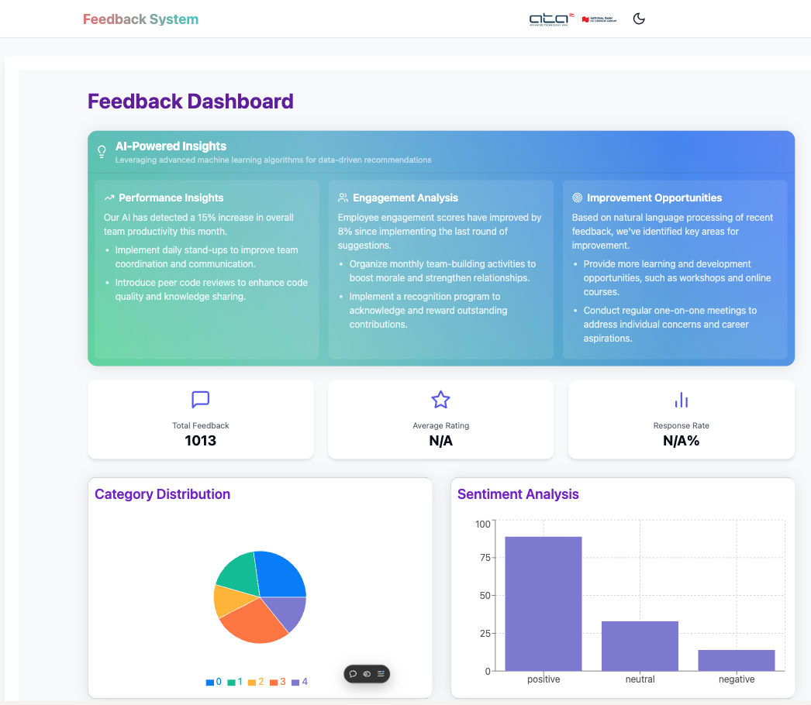
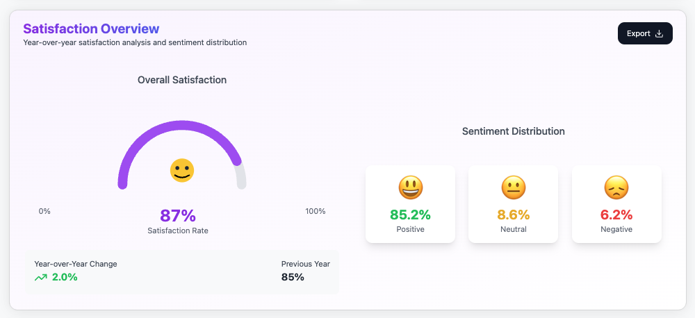
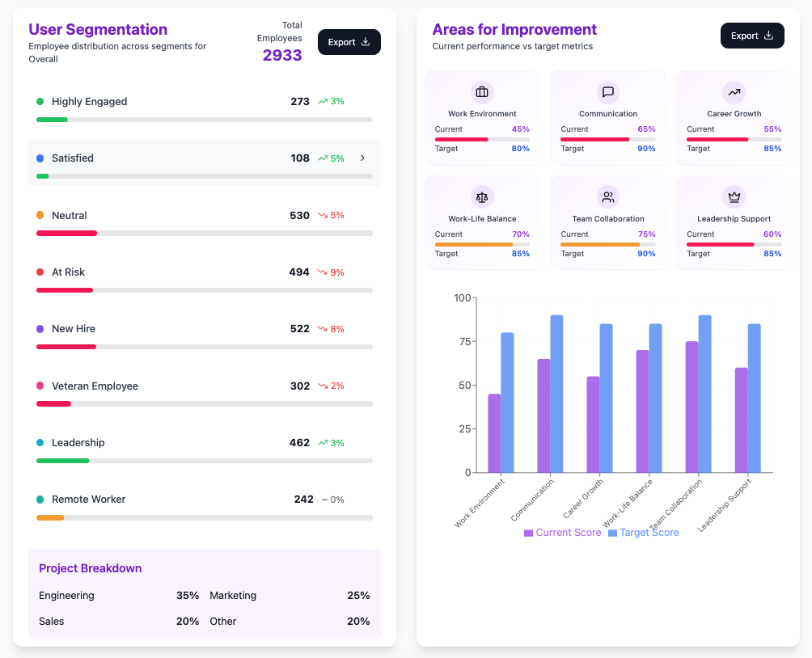

# Confidential Feedback System

This repository contains the **Confidential Feedback System**, designed to enhance employee engagement, streamline feedback processes, and improve workplace productivity. The system provides a secure and anonymous platform for employees to share feedback with their teams and HR, empowering organizations to act on insights and foster a healthy work environment.


## Table of Contents

- [Overview](#overview)
- [Features](#features)
- [Mock-ups](#mock-ups)
- [Technologies Used](#technologies-used)
- [System Architecture](#system-architecture)
- [Installation](#installation)
- [Usage](#usage)
- [Contributors](#contributors)
- [License](#license)

## Overview

The **Confidential Feedback System** aims to provide a safe and effective way for employees to share feedback anonymously or publicly. The system collects, analyzes, and visualizes feedback data to help companies like **ATA IT Limited** make data-driven decisions to improve team performance and workplace satisfaction.

### Key Objectives:
- Protect anonymity and ensure confidentiality of employee feedback.
- Utilize data-driven insights to improve employee satisfaction and productivity.
- Streamline feedback processes through automation and AI-driven analysis.

## Features

- **Anonymous and Named Feedback**: Employees can choose to provide feedback anonymously or attach their name.
- **Sentiment Analysis**: The system uses AI to categorize and analyze feedback sentiment.
- **Feedback Categories and Privacy Levels**: Customizable categories and privacy levels for different feedback types.
- **Real-Time Data Analytics**: View insights in real time via dashboards with key performance indicators (KPIs).
- **Secure Communication with HR**: Ensures confidentiality and security of sensitive feedback.
- **End-to-End Encryption**: Protects all feedback data in transit and at rest.
- **Role-Based Access Control (RBAC)**: Secure access to feedback data based on user roles.
- **Audit Logs**: Track feedback actions and ensure transparency.
- **Critical Feedback Alerts**: Immediate notifications for feedback requiring urgent attention.
- **Follow-Up Mechanism**: Allows HR to follow up with employees regarding critical feedback.
- **Multi-Platform Access**: Accessible via web and mobile applications.

## Mock-ups

Here are mock-ups of the **Confidential Feedback System**:


*Cover 1: Dashboard Overview*


*Cover 2: Feedback Submission Form*


*Cover 3: Sentiment Analysis*

These mock-ups give a visual representation of the front-end design of the system.

## Technologies Used

- **Frontend**: 
  - React.js
  - Next.js
  - Tailwind CSS
  - NextUI
- **Backend**: 
  - Java Spring Boot (Microservices Architecture)
- **Database**: 
  - MongoDB
- **Authentication & Authorization**: 
  - JWT (JSON Web Token)
  - OAuth
  - Role-Based Access Control (RBAC)
- **Others**:
  - Docker (Containerization)
  - Kubernetes (Orchestration)

  ## System Architecture

 <!-- Replace this with your actual system architecture diagram link if you have one. -->

The system is built using a microservices architecture to ensure scalability and flexibility. Below are the core components:

1. **Feedback Service**: Handles feedback submission and retrieval, supports both anonymous and named feedback.
2. **Analytics Service**: Runs sentiment analysis and processes feedback for insights.
3. **Notification Service**: Sends reminders, alerts, and notifications for critical feedback.
4. **UI/UX Layer**: Provides a seamless user experience for both employees and HR administrators.
5. **Authentication & Authorization Service**: Manages secure access to the system with RBAC.

## Usage
### For Employees:
1. Submit feedback using the feedback form.
2. Choose to submit feedback anonymously or under your name.
3. View the progress of feedback submissions on your dashboard.


### For HR/Admins:
1. Log in using secure credentials.
2. View categorized feedback and sentiment analysis.
3. Generate reports and view insights to make data-driven decisions.
4. Use the follow-up mechanism to respond to critical feedback.

# Contributors
- Nimit - Backend Developer, Frontend Developer, DevOps Developer, Project Manager
- Kritsakorn - Frontend Developer, UX/UI
- Kongphop - Frontend Developer, UX/UI

# License
This project is licensed under the MIT License. See the LICENSE file for details.

Developed with ❤️ by the team at ATA IT Limited and [SEEZ's Team Dev].

# HR Feedback System - Dockerized Microservices

This project provides a complete dockerized setup for the HR Feedback System, including all microservices and the frontend application.

## Architecture

The system consists of the following components:

1. **Discovery Service** - Eureka service registry (port 8087)
2. **User Service** - Handles user authentication and management (port 8081)
3. **Feedback Service** - Manages feedback forms and submissions (port 8084)
4. **Feedback Scoring Service** - AI-powered analysis of feedback (port 8085)
5. **Frontend** - React/Next.js web application (port 3000)
6. **PostgreSQL** - Database for User and Feedback services (port 5432)
7. **MongoDB** - Database for Feedback Scoring Service (port 27017)

## Prerequisites

- Docker and Docker Compose installed on your system
- Git for cloning the repository

## Getting Started

### 1. Clone the repository

```bash
git clone https://github.com/your-username/hr-feedback-system.git
cd hr-feedback-system
```

### 2. Start all services

```bash
docker-compose up -d
```

This command will:
- Build all service images
- Create and initialize the PostgreSQL databases
- Create and initialize the MongoDB database
- Start all services in the correct order with proper dependency management

### 3. Access the application

Once all services are up and running, you can access:

- Frontend application: http://localhost:3000
- User Service API: http://localhost:8081
- Feedback Service API: http://localhost:8084
- Feedback Scoring Service API: http://localhost:8085
- Eureka dashboard: http://localhost:8087

## Monitoring and Management

You can check the status of all services using:

```bash
docker-compose ps
```

View logs for a specific service:

```bash
docker-compose logs -f [service-name]
```

For example:
```bash
docker-compose logs -f feedback-scoring-service
```

## Stopping the Services

To stop all services but keep the containers:

```bash
docker-compose stop
```

To stop and remove the containers, networks, and volumes:

```bash
docker-compose down
```

To completely remove everything including images:

```bash
docker-compose down --rmi all -v
```

## Development Workflow

For local development, you can:

1. Run only the infrastructure services (PostgreSQL, MongoDB, Discovery):
   ```bash
   docker-compose up -d postgres mongodb discovery-service
   ```

2. Run specific services locally, connecting to the dockerized databases.

## Troubleshooting

### Database Connection Issues

If services can't connect to the databases, ensure:
- PostgreSQL and MongoDB containers are running
- Database initialization scripts have executed correctly
- Service environment variables match the database configurations

### Service Discovery Issues

If services can't register with Eureka:
- Check that discovery-service is healthy
- Verify EUREKA_CLIENT_SERVICEURL_DEFAULTZONE environment variables

### Frontend Access Issues

If the frontend can't access the backend services:
- Check that all backend services are healthy
- Verify NEXT_PUBLIC_* environment variables in the frontend container

## License

[Include appropriate license information]

## Frontend Development with Docker

When developing or running the frontend with Docker, you need to be aware of how API URLs work in a containerized environment:

### API URL Configuration

In a containerized environment, there are two different contexts for API calls:

1. **Server-Side Calls**: When Next.js makes server-side API calls, it's running inside the Docker container and needs to use the internal Docker network service names (e.g., `http://user-service:8081`).

2. **Client-Side Calls**: When browsers make API calls, they need to use the host machine's exposed ports (e.g., `http://localhost:8081`).

The frontend application includes utilities to handle this automatically:

```typescript
// Example usage in a component
import { getFeedbackServiceUrl, buildApiUrl, API_ENDPOINTS } from '@/lib/api-urls';

// Later in your code
const apiUrl = buildApiUrl(getFeedbackServiceUrl(), API_ENDPOINTS.AVAILABLE_FEEDBACKS);
const response = await fetch(apiUrl, {
  // ... fetch options
});
```

This utility automatically determines whether the code is running on the server or client and uses the appropriate URL.

### Environment Variables

The following environment variables are used by the frontend:

```
NEXT_PUBLIC_USER_SERVICE_URL=http://user-service:8081
NEXT_PUBLIC_FEEDBACK_SERVICE_URL=http://feedback-service:8084
NEXT_PUBLIC_FEEDBACK_SCORING_SERVICE_URL=http://feedback-scoring-service:8085
NEXT_PUBLIC_BROWSER_USER_SERVICE_URL=http://localhost:8081
NEXT_PUBLIC_BROWSER_FEEDBACK_SERVICE_URL=http://localhost:8084
NEXT_PUBLIC_BROWSER_FEEDBACK_SCORING_SERVICE_URL=http://localhost:8085
```

These are automatically configured in the Docker Compose setup.